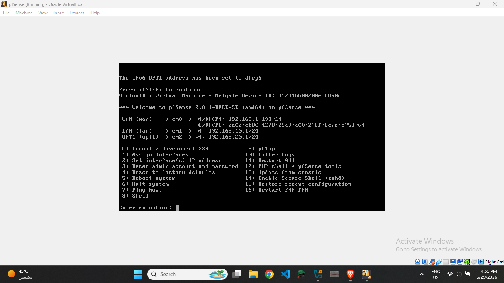
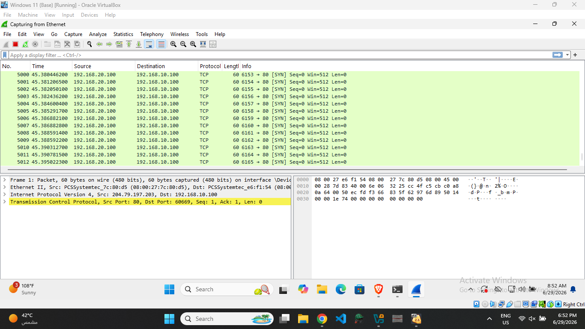

# Network Segmentation and Firewall Policy Validation with pfSense

## TL;DR

Designed and validated a segmented network using pfSense, VirtualBox, Windows, and Linux to enforce firewall policies between separate LANs. Generated controlled SYN flood traffic using hping3, analyzed the traffic with Wireshark, and verified that properly configured pfSense rules successfully blocked the attack. Along the way, I diagnosed why firewall rules initially failed and redesigned the lab to ensure all inter-host traffic traversed the firewall.

---

# Project Objectives

* Build a segmented virtual network using pfSense.
* Configure WAN and multiple LAN interfaces.
* Develop an understanding of firewall rule processing.
* Generate controlled SYN flood traffic for testing.
* Validate firewall enforcement using Wireshark.
* Troubleshoot network design issues affecting policy enforcement.

---

# Lab Architecture

The lab consisted of a pfSense firewall acting as the routing and policy enforcement device between two isolated internal networks.

* **pfSense Firewall**

  * WAN Interface
  * LAN 1 (Windows)
  * LAN 2 (Linux)

* **Windows VM**

  * IP Address: `192.168.10.100`

* **Linux VM**

  * IP Address: `192.168.20.100`

Traffic between the two endpoints was forced through pfSense, allowing firewall rules to inspect and control communication.

---

# Environment Setup

The environment was deployed entirely within VirtualBox.

Components included:

* pfSense Firewall
* Windows Virtual Machine
* Linux Virtual Machine
* VirtualBox Internal Networks
* Wireshark
* hping3

The firewall was configured with:

* WAN interface
* LAN 1 (192.168.10.0/24)
* LAN 2 (192.168.20.0/24)

This design ensured all communication between the Linux and Windows systems passed through pfSense.

*Figure: pfSense interface assignments for WAN, LAN 1, and LAN 2.*

---

# Traffic Generation

To validate firewall enforcement, controlled SYN traffic was generated from the Linux system toward the Windows system using **hping3** in a controlled lab environment.

The objective was not to simulate a sophisticated attack but to verify that firewall policies correctly inspected and controlled network traffic crossing between segmented networks.

Traffic generation was observed in real time using Wireshark.

*Figure: Wireshark capture showing SYN packets reaching the Windows host before firewall enforcement.*

---

# Firewall Policy Design

Firewall rules were created on the interface where traffic entered the firewall.

The configured policies included:

* Allow Linux to communicate with pfSense.
* Allow Linux to communicate with the Windows endpoint.
* Block SYN traffic originating from Linux toward the Windows system.

During the project, I learned that pfSense evaluates rules on the **ingress interface**, making interface selection just as important as the rule itself.

*Figure: Firewall rules configured on the ingress interface to allow and block traffic.*

---

# Troubleshooting & Lessons Learned

One of the most valuable parts of this project involved troubleshooting why the initial firewall rule failed.

Initially, both virtual machines resided on the same subnet. Because hosts on the same network communicate directly using Layer 2 switching, their traffic bypassed the firewall entirely. As a result, the configured firewall policy had no effect.

To resolve this, I redesigned the network by placing each endpoint on separate LANs connected through pfSense. This forced all traffic through the firewall, allowing policy enforcement and validating the configured rules.

This troubleshooting process significantly improved my understanding of:

* Layer 2 versus Layer 3 communication
* Network segmentation
* Firewall traffic flow
* Ingress interface rule evaluation
* Practical firewall troubleshooting

---

# Validation

After redesigning the lab:

* SYN traffic successfully traversed pfSense.
* Firewall rules matched the traffic as expected.
* Block policies prevented the SYN packets from reaching the Windows host.
* Wireshark confirmed that the blocked traffic no longer reached the destination.

*Figure: Packet capture confirming that SYN traffic no longer reaches the destination after firewall enforcement.*

*Figure: pfSense firewall logs showing blocked traffic.*

---

# Key Takeaways

* Designed a segmented virtual network using pfSense.
* Validated firewall policy enforcement with live network traffic.
* Applied packet analysis using Wireshark.
* Improved understanding of network segmentation and routing.
* Learned how firewall rule evaluation depends on the ingress interface.
* Diagnosed and resolved a common networking issue where same-subnet traffic bypasses firewall inspection.

---

# Tools Used

* pfSense
* VirtualBox
* Kali Linux
* Windows
* Wireshark
* hping3

---

# Final Notes

This project was conducted entirely within a controlled virtual lab environment. Network traffic was generated solely to validate firewall behavior, packet inspection, and policy enforcement. Rather than focusing only on firewall configuration, the project emphasized troubleshooting, network segmentation, and verifying that security controls operated as intended through packet analysis and firewall logs.
